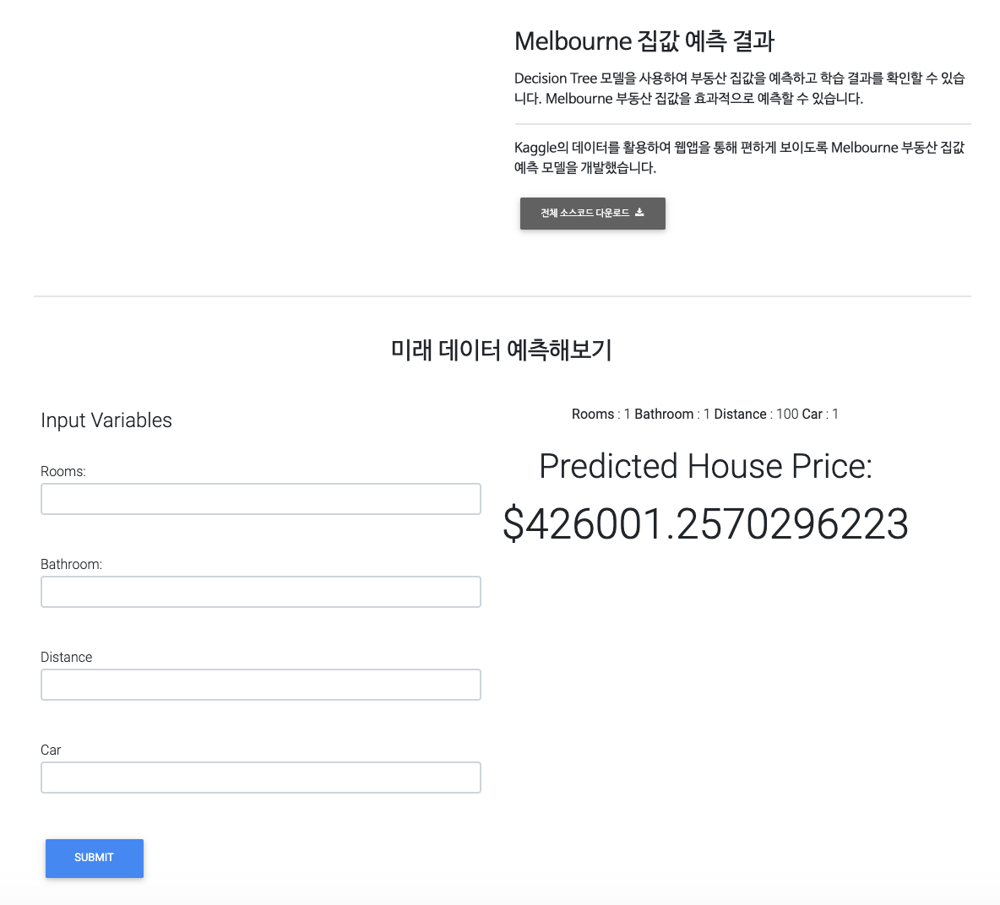

# Melbourne_housing_prediction
 
</img>
<h2>- Reference</h2>
dataset: https://www.kaggle.com/anthonypino/melbourne-housing-market  
ipynb:  
 (1)https://github.com/isheunesutembo/DecisionTrees  
 (2)https://github.com/isheunesutembo/Predicting-House-Prices-Using-Random-Forest-Flask-Web-Application  
template: https://mdbootstrap.com/freebies/jquery/full-page-video-carousel/  
 
</img>
 
<h2>- How to Use</h2>
 
(choice) 
0. start jupyter-notebook or anaconda  
0-1. start ipynb(1) or (2)  
0-2. 'housepriceprediction.joblib' file will be stored in your directory  
1. Start Cmd(Windows) or Terminal(macOS)  

    $ cd /Users/user/Downloads/Predicting_Melbourne_housig_price
    $ python3 app.py

2. go to http://localhost:5000/# 
3. Use this 
